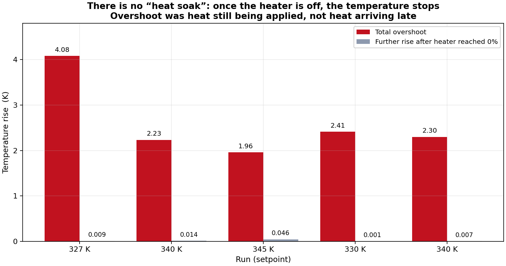
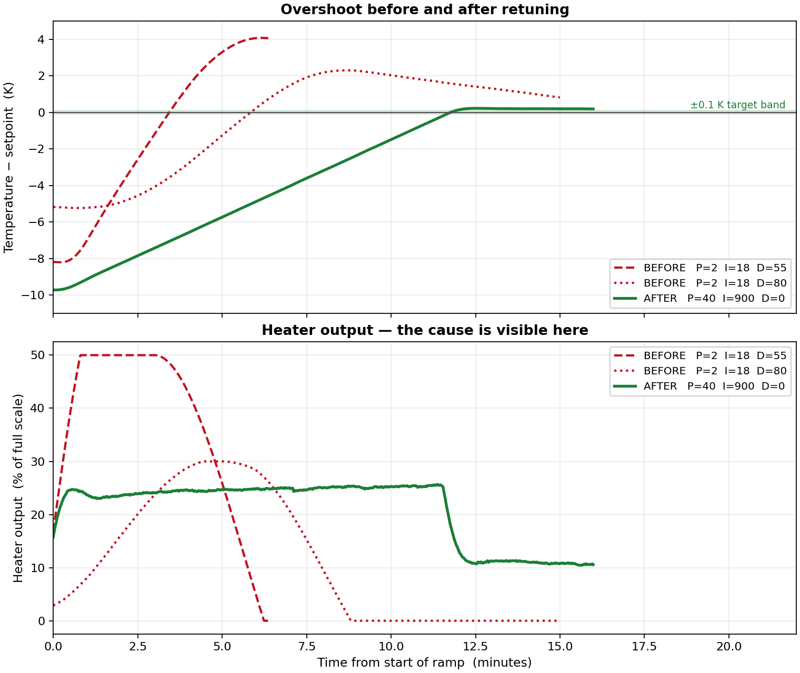
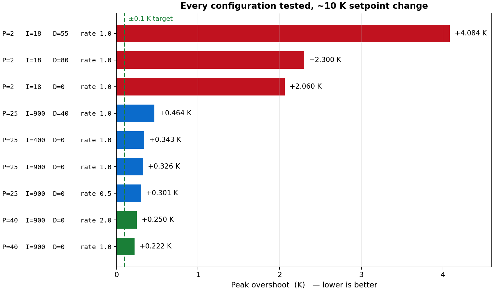
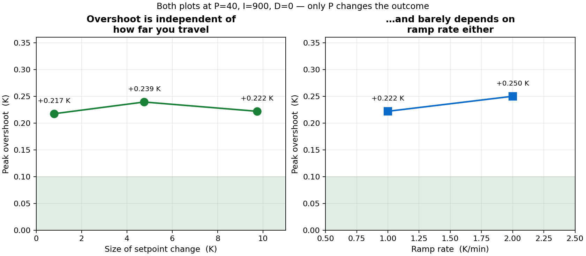
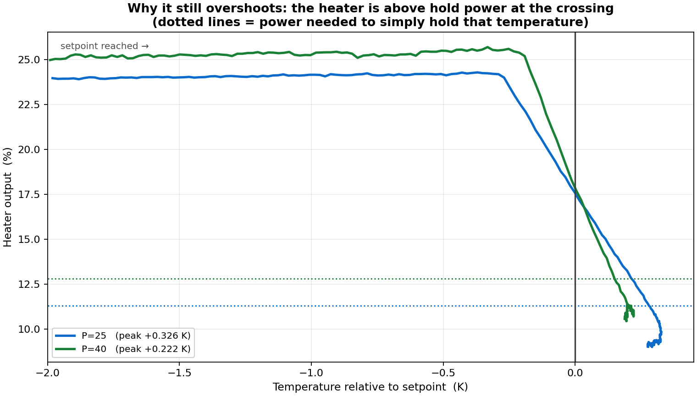
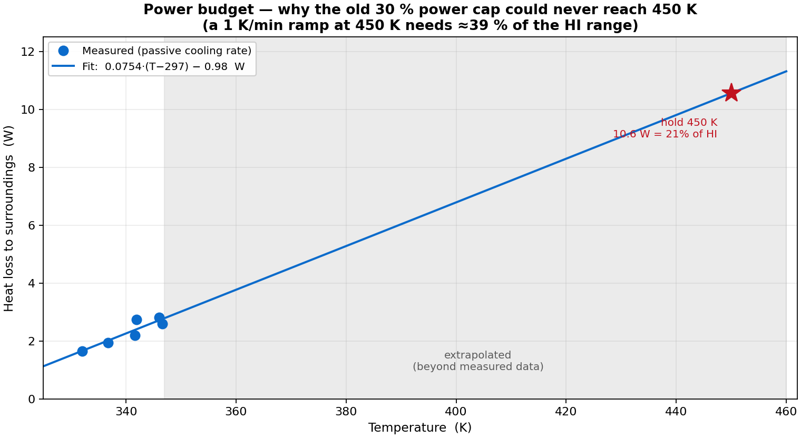

# Temperature Overshoot on the Janis Probe Station — Final Report

**Instrument:** Cryo-con 22C temperature controller (serial 206687, firmware 3.33G)
**Station:** Janis Research ST-LN-500_1-4CX LN₂ cryogenic probe station
**Chamber vacuum during all tests:** **1.5 × 10⁻² mBar**
**Dates:** 2026-09-04 → 2026-09-05
**Status:** Overshoot reduced from **+4.08 K** to **+0.22 K**. Remaining limit explained and quantified.

---

## 1. Summary in plain English

When you set a new temperature, the station used to sail past it by 2 to 4 degrees
and then sit there, stranded, for half an hour. Above 300 K there is no cooling —
only the heater — so once it goes too high the only way down is to wait for it to
lose heat naturally at about a quarter of a degree per minute.

The cause was not what the project documentation said it was. It was the PID
settings on the controller, and in particular one setting that had been adjusted
in the wrong direction for a long time because its units were misread.

After retuning, the station arrives at the target about **0.22 K high**, then
settles down smoothly and holds steady. That is roughly **20 times better** than
before.

It does not quite reach your ±0.1 K tolerance *at the moment of arrival*. Section 8
explains why that is a real physical limit of this controller rather than a tuning
problem, and Section 9 tells you what to do about it.

---

## 2. Equipment and conditions

| Item | Value |
|---|---|
| Controller | Cryo-con 22C, serial 206687, firmware 3.33G |
| Probe station | Janis ST-LN-500_1-4CX (LN₂ cryogenic probe station) |
| **Chamber vacuum** | **1.5 × 10⁻² mBar** |
| Sensor used | Channel A (Channel B reads a sensor fault and is unusable) |
| Heater load | 50 Ω, measured via `LOOP 1:LOAD?` |
| Heater range | HI = 50 W full scale |
| Communications | COM5, 57600 baud (upgraded from 9600), 8N1, `\r\n` terminated |
| Temperature range studied | 297 K → 450 K |
| Active cooling above 300 K | **None.** LN₂ cools only the low end of the range. |

The vacuum level matters for the numbers in Section 7: at 1.5 × 10⁻² mBar there is
still some gas conduction, so the measured heat-loss figures apply to this vacuum.
A significantly better or worse vacuum would change the heat loss, and therefore
the heater power needed at each temperature — though it would not change the
tuning conclusions.

---

## 3. What was wrong

### 3.1 The "heat soak" explanation was incorrect

The project documentation explained overshoot as heat continuing to soak into the
sample after the setpoint is reached. That is a testable claim: find the moment
the heater output actually reaches zero, then see how much further the temperature
rises.



*The red bars are the total overshoot. The grey bars are how much further the
temperature rose after the heater had already switched fully off. The grey bars
are essentially invisible — between 0.001 K and 0.046 K.*

The temperature stops climbing almost the instant the power stops. **There is no
stored-heat lag.** In every single run the overshoot happened because the heater
was **still switched on, at 27–29 % power, while the sample was already above the
setpoint** — for a remarkably consistent 166 to 170 seconds each time.

### 3.2 One setting had been adjusted the wrong way for months

On this controller, `IGAIN` is **not** a gain. It is the **integral time, in
seconds** (manual line 5440: *"a numeric field with units of seconds"*). A
**smaller** number therefore makes the integrator **faster and more aggressive**,
not gentler.

Every previous attempt lowered it to fight overshoot — 160 → 30.4 → 18 — which made
the problem worse each time. The file `write_pid_table02.py` still carried the
comment *"I = 30–45 → ~5× lower than original. Prevents integrator windup"*, which
is exactly backwards. Standard practice for thermal systems is 60–300 s or more.

### 3.3 The power cap could never have reached 450 K

An earlier session had capped heater power at 30 %. Section 7 shows that holding
450 K needs about 21 % and *ramping* at 1 K/min at 450 K needs about **39 %**. The
cap made the target physically unreachable and guaranteed the heater would run
pinned at its limit — which is what caused the integrator wind-up in the first place.

---

## 4. Before and after



*Top: temperature relative to setpoint. The red traces are the old settings —
they blow through the target and stay there. The green trace is the final tuning:
it rises smoothly and stops. Bottom: heater output, where the cause is visible.
The old settings slam the heater to its 50 % limit and hold it there; the new
settings hold a steady ~25 % during the climb and then cut cleanly to the ~11 %
needed to hold station.*

---

## 5. Everything that was tested



*Each bar is one hardware run at a ~10 K setpoint change. Red = original settings,
blue = intermediate attempts, green = final. The dashed line is the ±0.1 K target.*

Three of the four things that could be adjusted made no useful difference, and two
actively made things worse:

| Change | Result | Verdict |
|---|---|---|
| Integral time 900 → 400 s | +0.222 → +0.343 K | **Worse** |
| Derivative 0 → 40 | +0.326 → +0.464 K | **Worse** |
| Ramp rate 1.0 → 0.5 K/min | +0.326 → +0.301 K | No real change |
| Ramp rate 1.0 → 2.0 K/min | +0.222 → +0.250 K | No real change |
| **Proportional gain 25 → 40** | **+0.326 → +0.222 K** | **The only thing that helped** |

---

## 6. The key finding: overshoot does not depend on how far you move



*Left: setpoint changes of 0.8 K, 4.8 K and 9.7 K all produced the same ~0.22 K
overshoot. Right: doubling the ramp rate barely moved it either.*

This was the single most useful discovery, and it came from watching the live
traces rather than from theory.

**Why it happens:** the surplus heat that has to be shed when you arrive is the
*ramp power* — the extra wattage needed to make the temperature climb at all. That
depends only on how fast you are climbing, not on how far you have climbed. Whether
you moved 0.8 K or 10 K, you arrive carrying the same surplus, so you overshoot by
the same amount.

This one fact explains every other result: it is why hop size does not matter, why
integral time and derivative do not matter (neither changes the ramp power), and
why only the proportional gain helps (it is the only term that converts the
tracking lag into shed power).

**Practical consequence:** breaking a large temperature change into small steps
does **not** help. A 0.8 K step overshoots just as much as a 10 K one.

---

## 7. Why there is a floor, and where it is



*Heater output plotted against distance from the setpoint. Both traces sit flat
during the climb, then turn over sharply — but they are still well above the
dotted "hold power" line when they cross zero. That surplus is the overshoot.
P=40 (green) turns over later but falls much more steeply, which is why it does
better.*

The heater only begins backing off when the controller's internal moving setpoint
finishes its ramp. Before that moment the error is constant, so the output is
constant — the controller has no way of knowing the ramp is about to end.

Measured at the crossing point:

```
surplus to shed  =  ramp power 27.3 %  −  hold power 15.1 %  =  12.2 %
shed by P term   =  P 40  ×  tracking lag 0.16 K             =   6.4 %
predicted surplus remaining at crossing                       =   5.8 %
MEASURED surplus at crossing = 20.8 % − 15.1 %                =   5.7 %   ✓
```

Setting that remaining surplus to zero would need **P ≈ 76**. The estimated
stability limit for this loop is **P ≈ 82**, so zero overshoot sits essentially on
the stability boundary with no safety margin — at P ≈ 70 the loop would be expected
to start ringing.

**Conclusion: ~0.2 K is the floor for this controller using a single flat ramp.**
Reaching ±0.1 K at the moment of arrival would require a reduced final-approach
rate, which means a script actively changing the rate mid-ramp — the behaviour that
was ruled out for the LabVIEW deployment.

### Power budget to 450 K



*Heat loss measured from the natural cooling rate of every logged run, at
1.5 × 10⁻² mBar, extrapolated to 450 K.*

| Temperature | Power to hold | Power to hold **and** ramp at 1 K/min |
|---|---|---|
| 350 K | 3.0 W (6 %) | 12.2 W (24 %) |
| 400 K | 6.8 W (14 %) | 15.9 W (32 %) |
| **450 K** | **10.6 W (21 %)** | **19.7 W (39 %)** |

450 K was reached and held successfully during the overnight campaign, with a
measured holding power of **20.3–20.9 %** against the 21.1 % predicted here.

---

## 8. Final recommended settings

```
Proportional gain (PGAIN)   40
Integral time     (IGAIN)   900     seconds
Derivative        (DGAIN)   0
Heater range      (RANGE)   HI
Power limit       (MAXPWR)  70      percent
Ramp rate         (RATE)    1.0     K/min   (2.0 is equally good and twice as fast)
Control type      (TYPE)    RAMPP
```

**Do not use `RAMPT` or `TABLE` mode.** In those modes the controller ignores the
gains you send and reads them from PID Table 2 instead — which still contains the
old, bad values (P≈2, I=30–45, D=52–70). See Section 11.

---


## 8b. PID Table 2 as written to the instrument

Written to non-volatile memory on **2026-09-05** and verified by reading all 16 rows
back on a fresh connection — 16 of 16 correct. Previous contents saved to
`pid_table02_BACKUP_20260905_092227.txt` first.

This matters because `LOOP 1:TABLEIX?` returns `2` — Loop 1 is bound to this table.
Until now, any switch to `RAMPT` or `TABLE` mode would have silently restored the old gains.

**Zone 1 — 300 to 475 K (no active cooling) — retuned**

| Setpoint (K) | Was P / I / D | Now P / I / D | Range |
|---|---|---|---|
| 475 | 3.00 / 45.00 / 70.00 | **40.00 / 900.00 / 0.00** | HI |
| 450 | 2.90 / 43.00 / 68.00 | **40.00 / 900.00 / 0.00** | HI |
| 425 | 2.70 / 40.00 / 65.00 | **40.00 / 900.00 / 0.00** | HI |
| 400 | 2.60 / 38.00 / 63.00 | **40.00 / 900.00 / 0.00** | HI |
| 375 | 2.40 / 36.00 / 60.00 | **40.00 / 900.00 / 0.00** | HI |
| 350 | 2.30 / 34.00 / 58.00 | **40.00 / 900.00 / 0.00** | HI |
| 325 | 2.10 / 32.00 / 55.00 | **40.00 / 900.00 / 0.00** | HI |
| 300 | 2.00 / 30.00 / 52.00 | **40.00 / 900.00 / 0.00** | HI |

**Zone 2 — 77 to 275 K (LN₂ cooling) — left untouched, no data yet**

| Setpoint (K) | Was | Now P / I / D | Range |
|---|---|---|---|
| 275 | unchanged | 2.00 / 55.00 / 50.00 | HI |
| 250 | unchanged | 1.90 / 58.00 / 47.00 | HI |
| 225 | unchanged | 1.80 / 60.00 / 44.00 | HI |
| 200 | unchanged | 1.70 / 62.00 / 41.00 | HI |
| 175 | unchanged | 1.60 / 62.00 / 38.00 | HI |
| 150 | unchanged | 1.50 / 60.00 / 33.00 | HI |
| 120 | unchanged | 1.30 / 56.00 / 27.00 | HI |
| 77 | unchanged | 1.00 / 50.00 / 20.00 | MID |

> **Discontinuity at the zone boundary.** The table interpolates between rows, so
> between 275 K and 300 K the gains swing steeply from P=2 to P=40. That region is
> only reachable with LN₂ cooling active, which the station does not currently have —
> retune before the first cryogenic run rather than trusting it as-is.

> **Persistence.** The table survives a normal front-panel power-down. Per the manual,
> `SYSTEM:NVSAVE` additionally commits the whole instrument configuration to flash so it
> survives an *abrupt* power loss. It was **not** run, since it would also freeze every
> other current setting as the power-up default.


## 9. LabVIEW instructions

Serial settings: **COM5, 57600 baud (hardware upgraded on 22C front panel from 9600 for ultra-fast telemetry), 8 data bits, no parity, 1 stop bit.** Terminate
every command with **carriage-return + line-feed (`\r\n`)**. Allow roughly **50–100 ms**
between configuration commands. Queries end with `?` and return a single line.

### Step 1 — once at the start of a session

Send these in order to load the tuning:

```
LOOP 1:RANGE HI
LOOP 1:MAXPWR 70
LOOP 1:PGAIN 40
LOOP 1:IGAIN 900
LOOP 1:DGAIN 0
LOOP 1:RATE 1.0
```

Verify each with the matching query if you want confirmation, e.g. `LOOP 1:PGAIN?`
should return `40.000000`.

### Step 2 — for every temperature change

**The order of these commands matters. Getting it wrong causes a full-power surge.**

```
INPUT? A                     (read the current temperature, call it T_now)
LOOP 1:TYPE PID              (leave ramp mode so the next line takes effect instantly)
LOOP 1:SETPT <T_now>         (park the working setpoint at where you are now)
LOOP 1:TYPE RAMPP            (back into ramp mode)
CONTROL                      (turn the loop ON — must happen BEFORE the target)
LOOP 1:SETPT <target>        (LAST — this is what starts the ramp)
```

### Why that order, specifically

- **`CONTROL` must come before the target setpoint.** The ramp only runs while the
  loop is controlling. If you send the target while control is OFF, no ramp is
  armed — and the moment you switch control on, the controller sees the entire
  temperature error at once. With P=40 a 10 K error demands 400 % power, so the
  heater slams to its limit. This was observed directly: the heater pinned at 70 %
  for 35 seconds and wound the integrator up to 60 % when only 7 % was needed.
- **The setpoint must be sent last**, because writing the setpoint is what arms the
  ramp. Anything you change afterwards will not be applied to the ramp in progress.
- **The `TYPE PID` / `SETPT` / `TYPE RAMPP` sequence** re-synchronises the ramp to
  your current temperature. Without it the ramp resumes from wherever the previous
  setpoint left it, which can be far from where you actually are.

⚠️ **On your current front panel this means: press "Start Control" BEFORE
"Set Temperature", not after.** The panel default order will cause the power surge
described above.

### Step 3 — monitoring while it runs

```
INPUT? A                     temperature in K
LOOP 1:OUTP?                 heater output in % of full scale
LOOP 1:RAMP?                 returns YES while ramping, NO when finished
CONTROL?                     returns ON or OFF
```

### Step 4 — shutting down

```
STOP                         disengages the control loop and drops the heater to 0
CONTROL?                     confirm it returns OFF
```

Always confirm `CONTROL?` returns `OFF`. If a program is killed without sending
`STOP`, **the controller keeps heating to its last setpoint indefinitely.**

### Front panel controls that need adding or fixing

| Item | Issue |
|---|---|
| P / I / D defaults | Panel shows P=1.00, I=5.00, D=0.00 — near factory defaults and far worse than the tuned values. Change to 40 / 900 / 0. |
| Ramp Rate default | Panel shows 0.01 K/min. At that rate 273 → 450 K would take about 12 days. Set 1.0. |
| Range default | Panel shows LOW (0.5 W full scale). The station cannot heat on LOW or MID above ~330 K. Set HI. |
| `LOOP 1:TYPE` | No control exists. Without it you cannot guarantee RAMPP mode, and in Table mode your PID values are silently ignored. **Add this.** |
| `LOOP 1:MAXPWR` | No control exists. Add it, or hard-code 70. Never set 30 — it cannot sustain a ramp at 450 K. |
| "Set Resistor Value" button | Labelled for resistance but wired to a Range dropdown. Confirm it sends `LOOP 1:RANGE` and **not** `LOOP 1:LOAD` — the load must stay 50 Ω or every power reading becomes wrong. |

---

## 10. What you can expect in practice

| Measure | Before | After |
|---|---|---|
| Peak overshoot | +2.3 to +4.1 K | **+0.22 K** |
| Depends on jump size? | — | No |
| Depends on ramp rate? | — | Barely |
| Behaviour after arrival | stranded 30 min+ | smooth decay, then rock steady |
| 450 K reachable? | No (power cap too low) | **Yes, verified** |

**Operating procedure:** set the temperature, let it arrive, allow a short settling
period, then measure. Once inside your ±0.1 K band it stays there indefinitely —
stability was never the problem, only the approach.

Since overshoot is independent of jump size, there is no benefit to stepping in
small increments. Go directly to the temperature you want.

---

## 11. Honest limitations

1. **±0.1 K is not achieved at the instant of arrival.** It needs a short settling
   wait. Closing that gap requires reducing the ramp rate during the final
   approach, which needs an external script — the thing that was ruled out.
2. **PID Table 2 has now been rewritten** with the tuned Zone 1 values and verified
   (Section 8b). Zone 2 is untouched, so the 275–300 K interpolation region is not
   yet trustworthy.
3. **The 77–300 K cryogenic zone was never examined.** Its settings are likely
   wrong for the same units reason, but with LN₂ cooling active the dynamics are
   different and there is no data. **LN₂ is on order** — retune this zone once it
   arrives, using the same single-variable method rather than assuming the Zone 1
   values transfer.
4. **The heat-loss model is extrapolated** above ~347 K, where the measurements
   stop. The 450 K prediction matched reality well (21.1 % predicted vs 20.3–20.9 %
   measured), but it is an extrapolation, and it is specific to 1.5 × 10⁻² mBar.
5. **The stability limit of P ≈ 82 is calculated, not measured.** It was not tested
   directly, because doing so means deliberately driving the loop into oscillation.

---

## 12. Safety configuration

- **Over Temperature Disconnect: ENABLED, Channel A, 460 K.** Set by hand on the
  front panel. It is **not** remotely settable — every SCPI variant returns `NAK` —
  so no script can set, read back, or restore it. **If the instrument is ever reset
  it must be re-entered manually**, and nothing will warn you that it is missing.
- Channel B reads a sensor fault, so Channel A is the only usable source.
- The OTD is the only hardware-level protection: it opens a mechanical relay, so it
  works even if the fault is inside the controller's own output circuitry.
- Use `staged_ramp_test.py` for unattended runs — it sends `STOP` on every exit
  path. `pid_tune_test.py` does **not**, and will leave the heater running if the
  process is killed.

---

## 13. Files

```
FINAL_REPORT.html          this report, self-contained and printable
FINAL_REPORT.md            same report in Markdown
OVERSHOOT_TUNING_LOG.md    full technical log: every attempt, superseded theories
README.md                  project overview

data/                      26 measured runs (cryocon_log_*.csv)
                           + pid_table02_BACKUP_*.txt (table before overwrite)
figures/                   the six report figures
docs/                      Cryocon manual (md + pdf), objective, dev notes, handoff
archive/                   superseded scripts and the earlier report's generators
data_backup_20260904/      independent backup taken mid-study

staged_ramp_test.py        safe ramp runner - sends STOP on every exit path
live_view.py               live display; tails the log without occupying COM5
write_pid_table02.py       writes PID Table 2 to instrument NVRAM
make_final_figures.py      regenerates every figure in this report
cryocon_controller.py      controller driver
cryocon_gui.py             GUI
pid_controller.py          PID helper
monitor_only.py            read-only monitor
read_full_table.py         dumps PID tables from the instrument
```
