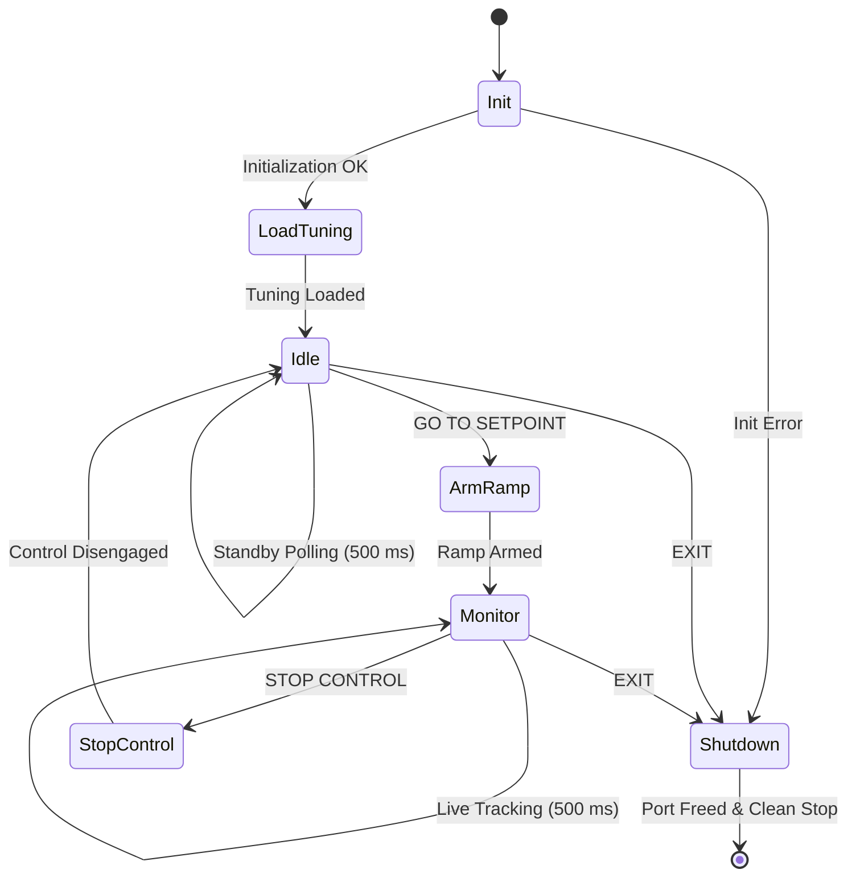

# Cryo-con 22C Temperature Ramp Controller: LabVIEW Implementation & Operating Guide

**Target System:** Janis Research ST-LN-500 Cryogenic Probe Station  
**Controller:** Cryo-con Model 22C (Firmware 3.33G, Serial 206687)  
**VI Path:** `D:\Labview\Cryo Con 2\CryoCon_RampControl.vi`  
**Communication:** Serial VISA (`COM5`, 9600 Baud, 8 Data Bits, 1 Stop Bit, No Parity, `\r\n` Line Termination)  

---

## 1. Executive Summary & Physical Principles

Operating a cryogenic probe station above 300 K presents a severe physical constraint: **there is zero active cooling without liquid nitrogen ($LN_2$)**. At ambient conditions, passive heat dissipation through radiative and conductive loss to the chamber is only $\sim 0.25\text{ K/min}$. Consequently, any temperature overshoot cannot be quickly recovered and can leave sensitive samples pinned above the target for tens of minutes.

To guarantee zero overshoot, the `CryoCon_RampControl.vi` architecture enforces two mandatory physical safeguards:

1. **Validated PID Parameterization:**  
   In Cryo-con instruments, **$I$ is integral time in seconds**, not an integral gain. Lower values accelerate integrator accumulation and cause violent windup. The validated baseline parameters are:
   - **Proportional Gain ($P$):** `40.0`
   - **Integral Time ($I$):** `900.0 s` (15 minutes)
   - **Derivative Gain ($D$):** `0.0`
   - **Heater Range:** `HI` (50 W full-scale authority)
   - **Maximum Power Cap:** `70.0%` (35 W ceiling)
   - **Ramp Rate:** `1.0 K/min`
   - **Loop Mode:** `RAMPP` (`PID control with ramp`)

2. **The Anti-Surge Command Ordering Rule:**  
   If a setpoint is written while the controller is idle (`CONTROL` is OFF) and control is subsequently engaged, the PID controller calculates an instantaneous error against the full step ($T_{\text{target}} - T_{\text{actual}}$), slamming the heater to 70% power for 30–45 seconds.  
   To eliminate this surge, the VI **parks the setpoint at the present temperature ($T_{\text{now}}$)**, engages `CONTROL`, and only writes the target setpoint *last* while already in `RAMPP` mode.

---

## 2. Finite State Machine Architecture

The VI is structured as an industrial-grade 7-state Moore machine running inside a top-level While Loop with shift registers carrying the State string, VISA Resource Session, and Error Cluster.

---

## 3. State-by-State Block Diagram Specification

### State 1: `"Init"`
* **Purpose:** Establishes communication session and queries instrument identity.
* **Execution Flow:**
  1. `CC_Initialize.vi` opens the VISA session with 9600 baud rate.
  2. `CC_IO.vi` sends `*IDN?` to verify the Cryo-con 22C responds.
  3. Displays response in the `Status` indicator.
  4. Automatically transitions to `"LoadTuning"`.
* **Shift Registers:** Error in/out and VISA in/out chained.

### State 2: `"LoadTuning"`
* **Purpose:** Enforces the validated PID tuning and hardware limits safely in software.
* **Execution Flow (Chained):**
  1. `Loop1_Range.vi`: Sets Loop 1 heater range to `HI` (50 W).
  2. `Loop_MaximumPower.vi`: Clamps maximum power to `70%`.
  3. `Loop_Set_PID.vi`: Sets $P = 40.0$, $I = 900.0\text{ s}$, $D = 0.0$.
  4. `Loop_RampRate.vi`: Sets ramp rate to `1.0 K/min`.
  5. Automatically transitions to `"Idle"`.

### State 3: `"Idle"`
* **Purpose:** Safe standby state. Monitors temperature and heater output without active heating.
* **Execution Flow:**
  1. `Wait (ms)`: 500 ms loop pacing.
  2. `Input_Read_Temp.vi`: Queries Channel A temperature $\to$ updates `Temperature (K)`.
  3. `Loop_Output_Power.vi`: Queries Loop 1 heater output % $\to$ updates `Heater (%)`.
  4. **Select Logic:**
     - If `GO TO SETPOINT` is pressed $\to$ transitions to `"ArmRamp"`.
     - Else if `EXIT` is pressed $\to$ transitions to `"Shutdown"`.
     - Else $\to$ remains in `"Idle"`.

### State 4: `"ArmRamp"` (Safety-Critical Sequence)
* **Purpose:** Arms the temperature ramp with zero surge current.
* **Strict Execution Sequence:**
  1. `Input_Read_Temp.vi` (Channel A): Reads current sample stage temperature ($T_{\text{now}}$).
  2. `Loop_Type.vi` (Loop 1, Mode `PID`): Temporarily drops back to normal PID mode to allow instantaneous setpoint placement.
  3. `Loop_Setpoint.vi` (Loop 1, Setpoint = $T_{\text{now}}$): Parks the working setpoint directly at the current temperature. Current error is instantly $0.00\text{ K}$.
  4. `Loop_Type.vi` (Loop 1, Mode `PID control with ramp`): Arms ramp mode (`RAMPP`).
  5. `Loop_CONTROL.vi`: Turns control loop ON. The heater activates smoothly at **0% power**.
  6. `Loop_Setpoint.vi` (Loop 1, Setpoint = `Target Setpoint (K)`): Sets the final destination setpoint. The internal ramp generator begins climbing at $1.0\text{ K/min}$.
  7. Automatically transitions to `"Monitor"`.

### State 5: `"Monitor"`
* **Purpose:** Real-time tracking during heating and temperature ramps.
* **Execution Flow:**
  1. `Wait (ms)`: 500 ms timing.
  2. `Input_Read_Temp.vi`: Reads Channel A temperature $\to$ updates `Temperature (K)` indicator via Local Variable.
  3. `Loop_Output_Power.vi`: Reads Loop 1 heater % $\to$ updates `Heater (%)` indicator via Local Variable.
  4. **Select Logic:**
     - If `STOP CONTROL` is pressed $\to$ transitions to `"StopControl"`.
     - Else $\to$ loops in `"Monitor"`.

### State 6: `"StopControl"`
* **Purpose:** Disengages active heating safely when the user aborts or reaches holding temperature.
* **Execution Flow:**
  1. `Loop_STOP.vi`: Sends the `STOP` command, zeroing heater output immediately.
  2. Automatically transitions to `"Idle"`.

### State 7: `"Shutdown"`
* **Purpose:** Clean, guaranteed shutdown on exit.
* **Execution Flow:**
  1. `Loop_STOP.vi`: Unconditionally zeroes heater power before releasing the port.
  2. `CC_Close.vi`: Closes the VISA communication handle.
  3. `Simple Error Handler.vi`: Catches and logs any communication errors.
  4. **Loop Stop:** Wires a Boolean constant `True` to the While Loop stop terminal (configured with *"Use Default If Unwired"* across other states) to stop execution.

---

## 4. Front Panel Controls & Indicators

| Control / Indicator Name | Type | Function |
|---|---|---|
| **`VISA Resource`** | Control (VISA Resource Name) | Selects communication port (`COM5` for hardware, TCP socket for simulator). |
| **`Target Setpoint (K)`** | Control (DBL Numeric) | Desired target temperature in Kelvin (e.g., 320 K). |
| **`GO TO SETPOINT`** | Control (Boolean Button) | Latches command to begin ramp sequence from `"Idle"`. |
| **`STOP CONTROL`** | Control (Boolean Button) | Immediately halts heating from `"Monitor"` and returns to `"Idle"`. |
| **`EXIT`** | Control (Boolean Button) | Safely disengages heater, closes COM port, and stops the VI. |
| **`Temperature (K)`** | Indicator (DBL Numeric) | Real-time Channel A temperature reading. |
| **`Heater (%)`** | Indicator (DBL Numeric) | Real-time Loop 1 heater output percentage. |
| **`Status`** | Indicator (String) | Displays instrument identity and status feedback. |

---

## 5. Operating Protocol

### Step 1: Pre-Power Inspection & Hardware Setup
1. Confirm Janis probe station vacuum is $\le 10^{-4}\text{ Torr}$ before engaging heating.
2. Confirm the physical Over-Temperature Disconnect (OTD) is manually verified on the 22C front panel (Channel A set to $460\text{ K}$).
3. Connect RS-232 cable to the PC (`COM5`).

### Step 2: Launching the VI
1. Open `D:\Labview\Cryo Con 2\CryoCon_RampControl.vi`.
2. Confirm `VISA Resource` is set to `COM5` (or the relevant COM port).
3. Click the white **Run** arrow. The VI initializes, loads tuning ($P=40, I=900, D=0$, Range HI, Max 70%), and enters `"Idle"` displaying ambient temperature (e.g., $295\text{ K}$).

### Step 3: Starting a Temperature Ramp
1. Enter your desired temperature in **`Target Setpoint (K)`** (e.g., $320.0$).
2. Click **`GO TO SETPOINT`**.
3. The VI transitions to `"ArmRamp"` (zeroing error and arming ramp) then automatically enters `"Monitor"`.
4. Observe `Temperature (K)` climbing at $1.0\text{ K/min}$ with `Heater (%)` smooth and stable (typically $15\text{--}25\%$, never surging to $70\%$).

### Step 4: Stopping or Exiting
* To pause or stop heating: Click **`STOP CONTROL`**. Heater output goes to 0% and the system returns to `"Idle"`.
* To exit the program: Click **`EXIT`**. Heater shuts down unconditionally, VISA session closes, and the VI stops cleanly.
